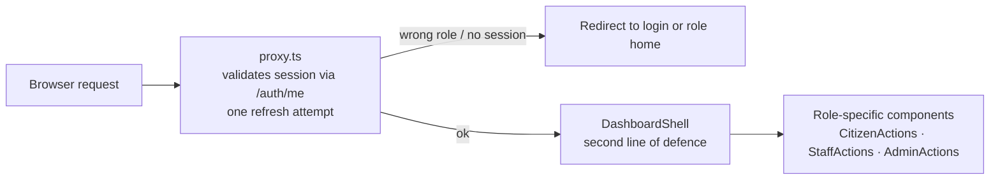
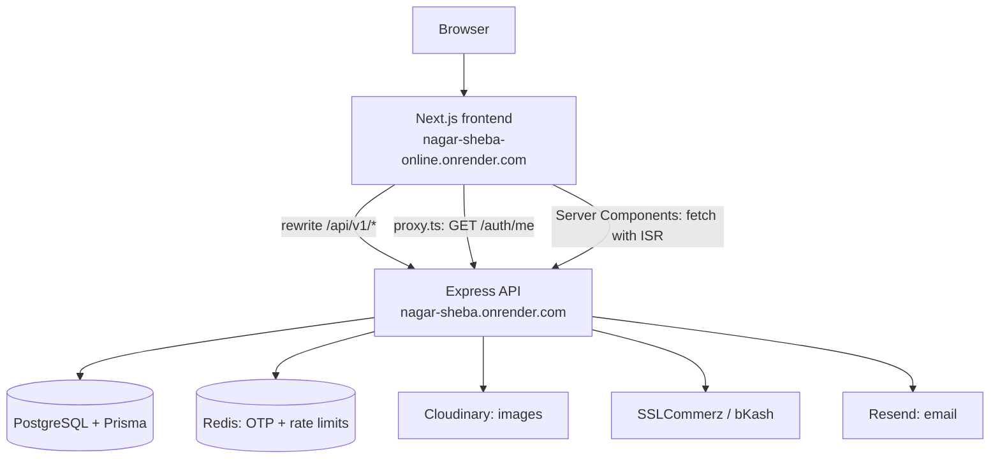
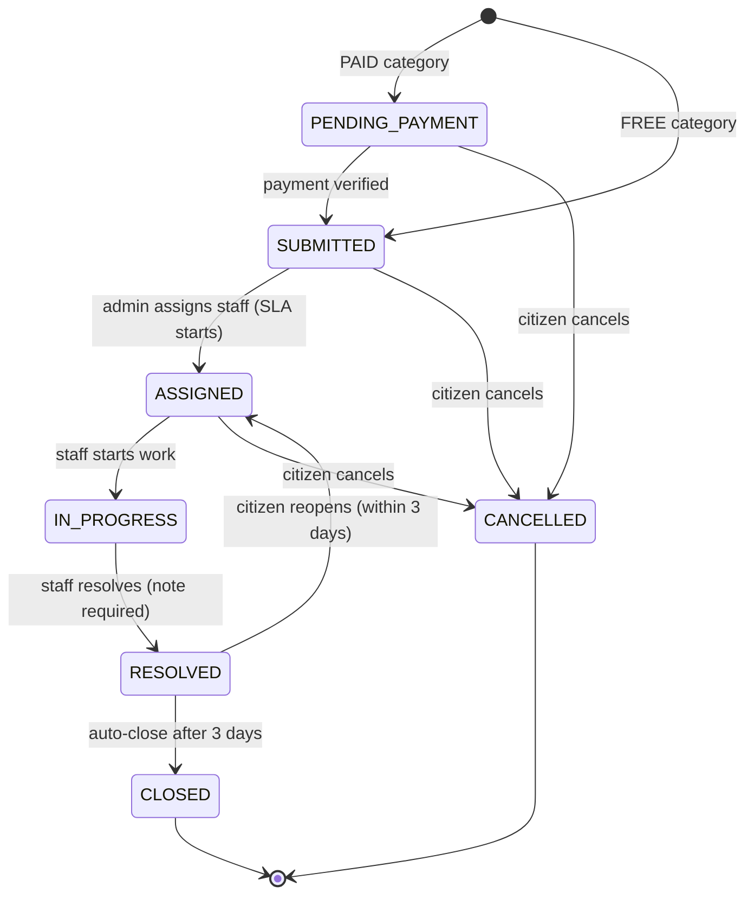
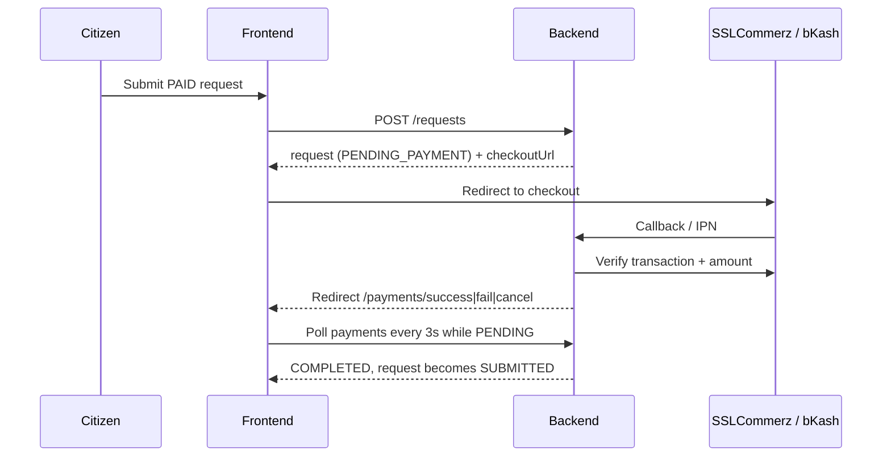

<div align="center">

# 🏙️ Nagar Sheba — Frontend

### Report it. Track it. See it fixed.

A role-aware web client for a **City Complaint & Service Request Platform**.
Citizens report civic issues and pay permit fees, department staff work a scoped queue,
and administrators get analytics, oversight and a full audit trail.

[](https://nextjs.org/)
[](https://react.dev/)
[](https://www.typescriptlang.org/)
[](https://tailwindcss.com/)
[](https://tanstack.com/query)
[](https://nagar-sheba-online.onrender.com)

[🌐 Live Frontend](https://nagar-sheba-online.onrender.com) ·
[⚙️ Live Backend API](https://nagar-sheba.onrender.com) ·
[📦 Backend Repo](https://github.com/parety308/Nagar-Sheba) ·
[💻 Frontend Repo](https://github.com/parety308/Nagar-Sheba-Frontend)

</div>

---

## 📖 Table of Contents

1. [Overview](#-overview)
2. [Live Links](#-live-links)
3. [Feature Highlights](#-feature-highlights)
4. [Tech Stack](#️-tech-stack)
5. [Roles & Access Control](#-roles--access-control)
6. [Pages & Routes](#️-pages--routes)
7. [Architecture](#-architecture)
8. [Request Lifecycle](#-request-lifecycle)
9. [Authentication Flow](#-authentication-flow)
10. [Payment Flow](#-payment-flow)
11. [State, Data & Forms](#-state-data--forms)
12. [Project Structure](#-project-structure)
13. [Getting Started](#-getting-started)
14. [Environment Variables](#-environment-variables)
15. [Scripts](#-scripts)
16. [Deployment on Render](#️-deployment-on-render)
17. [Accessibility & Performance](#-accessibility--performance)
18. [Security Notes](#-security-notes)
19. [Demo Accounts](#-demo-accounts)
20. [Troubleshooting](#-troubleshooting)
21. [Related Repository](#-related-repository)

---

## 🎯 Overview

City residents often report potholes, water leaks, missed garbage collection or apply for licences
through scattered, informal channels with **no tracking, no deadlines and no accountability**.

**Nagar Sheba** ("City Service") replaces that with one platform:

| For | What they get |
|---|---|
| 👤 **Citizens** | File a request in 4 steps, attach photos, pay fees online, follow every status change, reopen or rate the result |
| 🛠️ **Staff** | A queue scoped to their own department, start/resolve assigned work, upload resolution proof, personal performance stats |
| 🛡️ **Admins** | Manage departments, categories, users and staff, reassign or override requests, refund payments, reports and audit logs |

This repository is the **frontend** (Next.js App Router). It talks to the Express + Prisma + PostgreSQL
backend listed under [Related Repository](#-related-repository).

---

## 🔗 Live Links

| Resource | URL |
|---|---|
| 🌐 Frontend (live) | https://nagar-sheba-online.onrender.com |
| ⚙️ Backend (live) | https://nagar-sheba.onrender.com |
| 🔌 API base | `https://nagar-sheba.onrender.com/api/v1` |
| 💻 Frontend repo | https://github.com/parety308/Nagar-Sheba-Frontend |
| 📦 Backend repo | https://github.com/parety308/Nagar-Sheba |

> ⏳ **Heads up:** Render free instances sleep when idle. The first request after a pause can take
> 30–60 seconds. The UI shows skeleton loaders and retry states while the server wakes up.

---

## ✨ Feature Highlights

- 🔐 **3 fixed roles** (Citizen, Staff, Admin) enforced at three layers: route guard, layout guard, and UI.
- ⚡ **One-click demo login** for every role on the login page.
- 🧭 **4-step request wizard**: service → details → photos → review, with per-step validation,
  "use my location" geolocation, live OpenStreetMap preview and upload progress.
- 💳 **Real payment gateways**: SSLCommerz and bKash (sandbox) with success / fail / cancel pages
  that **poll every 3 s** until the gateway confirms.
- 📄 **PDF receipts** for completed or refunded payments.
- 📊 **Admin analytics** built with Recharts (status bars, role donut, department bars, rating
  distribution, revenue by provider) plus **CSV export**.
- 🔗 **URL-synced state**: filters, search, sort and page live in the query string, so any view is shareable.
- 🔔 **Notifications**: bell dropdown with 30 s polling, optimistic mark-as-read, and a full page.
- 🔁 **Smart sessions**: single-flight token refresh so parallel 401s trigger only one refresh call.
- 🌗 **Dark mode** with no flash on load, reduced-motion support, skip-to-content link, ARIA labels.
- 🦴 **Skeleton loaders, empty states, error boundaries and toasts** for every API failure.
- 🔎 **SEO ready**: per-page metadata, Open Graph, `sitemap.ts`, `robots.ts`, ISR on public pages.
- 🔑 **Google Sign-In** alongside email + OTP registration.

---

## 🛠️ Tech Stack

| Category | Technology |
|---|---|
| Framework | **Next.js 16** (App Router), **React 19**, **TypeScript** (strict) |
| Styling & UI | **Tailwind CSS v4**, shadcn/ui (`base-mira` style on **Base UI**), `class-variance-authority`, `tw-animate-css` |
| Server state | **TanStack Query v5** |
| Forms & validation | **TanStack Form** + **Zod v4** (schemas mirror backend rules) |
| HTTP | **ofetch** with a single-flight refresh wrapper |
| Auth | httpOnly cookie JWT (access + refresh), Google Identity Services |
| Charts | **Recharts v3** |
| Motion | **motion** (Reveal, Stagger, CountUp, layout-animated nav pill) |
| Toasts | **Sonner** |
| Icons | Lucide React, React Icons |
| Code quality | **Biome** (lint + format + organize imports) |
| Hosting | **Render** |

> ℹ️ This project uses Next.js 16, where `middleware.ts` is replaced by **`proxy.ts`**.
> See `AGENTS.md` and `node_modules/next/dist/docs/` before changing framework-level conventions.

---

## 👥 Roles & Access Control

| Role | Home | Capabilities |
|---|---|---|
| 👤 **Citizen** | `/citizen` | File requests, upload evidence, pay fees, cancel, reopen within 3 days, rate resolved work, download receipts, manage profile |
| 🛠️ **Staff** | `/staff` | See their department queue, start and resolve **only requests assigned to them**, upload resolution proof, view performance |
| 🛡️ **Admin** | `/admin` | Departments, categories, users and staff, reassign or override requests, refund payments, feedback, reports, audit logs |

Access is enforced in **three layers**:



1. **`src/proxy.ts`**: asks the backend who you are, refreshes tokens once if needed, redirects by role.
2. **`DashboardShell`**: covers expired or cleared sessions on the client.
3. **Components**: render only the actions your role may perform.

The backend independently re-checks the database on every request, so blocked or deleted accounts are
rejected even with a still-valid token.

---

## 🗺️ Pages & Routes

### 🌍 Public (Server Components, full SEO metadata)

| Route | Purpose |
|---|---|
| `/` | Landing: hero, live stats, how it works, popular services, departments, CTA |
| `/services` | All services grouped by department, with a department filter |
| `/services/[id]` | Service detail (ISR, `generateStaticParams` + `generateMetadata`) |
| `/about-us` · `/faq` · `/contact` | Marketing and support pages (contact form posts to the API) |
| `/privacy` · `/terms` | Legal pages |

### 🔑 Authentication

`/login` (demo panel + Google) · `/register` · `/verify-email` (OTP + resend cooldown) · `/forgot-password` · `/reset-password`

### 💳 Payment redirects

`/payments/success` · `/payments/fail` · `/payments/cancel`

### 👤 Citizen: `/citizen/*`

`/` overview · `/requests` · `/requests/new` (wizard) · `/requests/[id]` · `/payments` · `/notifications` · `/profile`

### 🛠️ Staff: `/staff/*`

`/` overview · `/requests` · `/requests/[id]` · `/performance` · `/notifications` · `/profile`

### 🛡️ Admin: `/admin/*`

`/` overview with charts · `/requests` · `/requests/[id]` · `/departments` · `/categories` · `/users` ·
`/payments` · `/feedbacks` · `/reports` · `/audit-logs` · `/notifications` · `/profile`

### 🧰 Utility

`not-found.tsx` · `error.tsx` · `global-error.tsx` · `loading.tsx` and `error.tsx` per dashboard · `robots.ts` · `sitemap.ts`

---

## 🧱 Architecture



**Key design decisions**

- **Server Components by default.** `"use client"` is added only where state, effects or handlers are needed.
- **Same-origin API via rewrites.** `next.config.ts` rewrites `/api/v1/:path*` to `BACKEND_URL`, so
  auth cookies stay first-party in the browser.
- **Three-tier data layer:**
  `src/api/*` (typed request functions) → `src/hook/*` (TanStack Query hooks) → components.
- **One invalidation helper per domain** (`useInvalidateRequests`) so mutations refresh the right caches.
- **Fail-soft public pages.** `lib/server-api.ts` uses `next: { revalidate }` and returns `null` / `[]`
  if the backend is asleep, so marketing pages never crash.
- **Reusable building blocks:** `StatCard`, `StatusBadge`, `Pagination`, `SearchInput`, `FilterSelect`,
  `EmptyState`, `ErrorState`, `ConfirmDialog`, `PageHeader`, `TextField`, `StarRating`, `UploadProgress`.
- **Custom hooks:** `useUrlState`, `useDebounce`, `useCountdown`, `useObjectUrls`, plus one hook file per API domain.

---

## 🔄 Request Lifecycle



| Rule | Detail |
|---|---|
| ⏱️ SLA clock | Starts when a request becomes **Assigned** (`category.slaHours`) |
| 🚩 Overdue | Background job flags non-terminal requests past their deadline (admins see an **Overdue** badge) |
| 🔁 Reopen | Citizen may reopen within **3 days** of resolution, with a reason |
| 🔒 Auto-close | Resolved requests close automatically after the 3-day window |
| 💸 Cancel + refund | Cancelling a paid request triggers an automatic refund; admins can retry failures |
| 📷 Attachments | Up to **5 images**, 5 MB each (evidence from citizens, proof from staff) |

---

## 🔐 Authentication Flow

1. `POST /auth/login` sets **httpOnly** `accessToken` and `refreshToken` cookies.
2. `useLogin` then loads `/auth/me`, seeds the `["user"]` query and redirects to the role home
   (or a safe `?redirect=` path with **open-redirect protection**).
3. On a `401`, `apiClient` runs a **single-flight refresh** and retries once. Auth endpoints are excluded
   so wrong credentials never trigger refresh loops.
4. `proxy.ts` forwards rotated `Set-Cookie` headers to the browser.
5. Accounts created by an admin carry `mustChangePassword`; a banner links to the profile page until it is changed.

**Registration** is email + OTP (6 digits, 5 minutes, 60 s resend cooldown). **Google** accounts have no
password section in the profile.

---

## 💳 Payment Flow



If no session was created, the request page offers **Pay with SSLCommerz** or **Pay with bKash**.
Failed automatic refunds can be retried by an admin from `/admin/payments`.

---

## 🧠 State, Data & Forms

| Concern | Approach |
|---|---|
| Server state | TanStack Query (`staleTime` 60 s, smart retry that skips 401/403/404) |
| Session | `["user"]` query, `useProfile()` |
| Filters / search / pagination | `useUrlState`: single source of truth in the URL; changing a filter resets `page` |
| Search | Debounced 400 ms via `useDebounce` |
| Forms | TanStack Form with Zod schemas in `src/validation/*` |
| Uploads | XHR with progress events (`lib/upload.ts`) and automatic refresh on 401 |
| Notifications | 30 s polling, optimistic update with rollback on error |
| Theme | Pre-hydration inline script (no flash), `ThemeProvider`, `ns-theme` in localStorage |

---

## 📁 Project Structure

```text
src/
├─ app/
│  ├─ (public)/
│  │  ├─ (marketing)/          # home, services, about, faq, contact, privacy, terms
│  │  ├─ (authentication)/     # login, register, verify-email, forgot/reset password
│  │  └─ payments/             # success, fail, cancel
│  ├─ (dashboard)/
│  │  └─ admin/ staff/ citizen/   # each: layout, loading, error, template, pages
│  ├─ error.tsx  global-error.tsx  not-found.tsx
│  └─ layout.tsx  globals.css  robots.ts  sitemap.ts  template.tsx
├─ components/
│  ├─ ui/             # shadcn primitives on Base UI
│  ├─ shared/         # StatCard, StatusBadge, Pagination, EmptyState, ...
│  ├─ form/           # Login, Register, Verify, Reset, Contact, Demo panel, Google
│  ├─ request/        # wizard, list, detail, actions, gallery, timeline
│  ├─ admin/  staff/  dashboard/  payment/  notification/  profile/
│  ├─ layout/         # homepage navbar/footer + dashboard shell
│  └─ home/  motion/
├─ api/               # typed API functions per domain
├─ hook/              # TanStack Query hooks + utility hooks
├─ validation/        # Zod schemas (match backend rules)
├─ types/             # API and domain types
├─ lib/               # apiClient, upload, format, status, roles, server-api, utils
├─ config/            # navigation, demo accounts, site info
├─ providers/         # Query, Theme, Motion
└─ proxy.ts           # role-based route protection
```

---

## 🚀 Getting Started

### Prerequisites

- Node.js **20+**
- A running **Nagar Sheba backend** (local, or the hosted API above)

### Install & run

```bash
git clone https://github.com/parety308/Nagar-Sheba-Frontend.git
cd Nagar-Sheba-Frontend
npm install
cp .env.example .env.local     # then fill in the values
npm run dev
```

Open **http://localhost:3000**.

### Run against the hosted backend (no local backend needed)

```dotenv
BACKEND_URL=https://nagar-sheba.onrender.com/api/v1
NEXT_PUBLIC_SITE_URL=http://localhost:3000
```

> ⚠️ If you use a local or hosted backend, its `FRONTEND_URL` must equal this app's origin
> (for CORS, cookies and payment redirects), and its `BACKEND_URL` must be publicly reachable by
> SSLCommerz / bKash for callbacks.

---

## 🔑 Environment Variables

| Variable | Required | Description |
|---|:-:|---|
| `BACKEND_URL` | ✅ | Backend API base used by rewrites, `proxy.ts` and server fetches |
| `NEXT_PUBLIC_SITE_URL` | ✅ | Public site origin for metadata, sitemap and robots |
| `NEXT_PUBLIC_API_URL` | ➖ | Override the browser API base. Defaults to `/api/v1` (rewritten to `BACKEND_URL`) |
| `NEXT_PUBLIC_GOOGLE_CLIENT_ID` | ➖ | Enables the Google button (hidden when empty) |
| `NEXT_PUBLIC_DEMO_ADMIN_EMAIL` / `_PASSWORD` | ➖ | Admin demo login |
| `NEXT_PUBLIC_DEMO_STAFF_EMAIL` / `_PASSWORD` | ➖ | Staff demo login |
| `NEXT_PUBLIC_DEMO_CITIZEN_EMAIL` / `_PASSWORD` | ➖ | Citizen demo login |

**Production values**

```dotenv
BACKEND_URL=https://nagar-sheba.onrender.com/api/v1
NEXT_PUBLIC_SITE_URL=https://nagar-sheba-online.onrender.com
NEXT_PUBLIC_GOOGLE_CLIENT_ID=<your-google-oauth-client-id>

NEXT_PUBLIC_DEMO_ADMIN_EMAIL=<demo-admin-email>
NEXT_PUBLIC_DEMO_ADMIN_PASSWORD=<demo-admin-password>
NEXT_PUBLIC_DEMO_STAFF_EMAIL=<demo-staff-email>
NEXT_PUBLIC_DEMO_STAFF_PASSWORD=<demo-staff-password>
NEXT_PUBLIC_DEMO_CITIZEN_EMAIL=<demo-citizen-email>
NEXT_PUBLIC_DEMO_CITIZEN_PASSWORD=<demo-citizen-password>
```

> 💡 The rewrite in `next.config.ts` is read **at build time**. After changing `BACKEND_URL`, redeploy
> (rebuild), not just restart.

---

## 📜 Scripts

| Command | Description |
|---|---|
| `npm run dev` | Start the dev server |
| `npm run build` | Production build |
| `npm start` | Serve the production build |
| `npm run lint` | Biome check |
| `npm run format` | Biome format (write) |
| `npm run format:fix` | Biome check with auto-fix |

---

## ☁️ Deployment on Render

**Frontend** → https://nagar-sheba-online.onrender.com

| Setting | Value |
|---|---|
| Service type | Web Service (Node) |
| Build command | `npm install && npm run build` |
| Start command | `npm start` |
| Node version | 20+ |

**Steps**

1. Create a Web Service from the frontend repo.
2. Add the [environment variables](#-environment-variables). Set `BACKEND_URL` to
   `https://nagar-sheba.onrender.com/api/v1` and `NEXT_PUBLIC_SITE_URL` to
   `https://nagar-sheba-online.onrender.com`.
3. On the **backend** service, set `FRONTEND_URL=https://nagar-sheba-online.onrender.com` and redeploy,
   so CORS, cookies and payment redirects resolve correctly.
4. Deploy. Public pages use ISR, so the first requests warm the cache.

---

## ♿ Accessibility & Performance

- Skip-to-content link, `aria-current` on navigation, labelled icon buttons, `role="alert"` on field
  errors, `aria-invalid` / `aria-describedby` wiring.
- Charts expose `role="img"` labels and visually hidden data tables for screen readers.
- Native `<select>` filters for built-in keyboard and screen-reader support.
- `prefers-reduced-motion` respected globally and through `MotionConfig`.
- `next/image` for Cloudinary images (`remotePatterns` configured), lazy-loaded map iframes,
  dynamic imports for chart-heavy pages, ISR on public pages, `keepPreviousData` to avoid list flicker.

---

## 🔒 Security Notes

- Tokens live in **httpOnly cookies**; nothing sensitive sits in JavaScript-accessible storage.
- Redirect targets are validated to same-site relative paths only.
- The backend re-validates the user on every request (blocked or deleted accounts are rejected).
- ⚠️ **Every `NEXT_PUBLIC_*` value is bundled into browser JavaScript**, including demo passwords.
  Use dedicated demo accounts that hold no real data, rotate them after evaluation, and never put real
  secrets in a `NEXT_PUBLIC_*` variable.
- Never commit `.env*` files (only `.env.example`).

---

## 🧪 Demo Accounts

The login page offers **one-click Demo Login** buttons for each role. Buttons are disabled with a tooltip
if the matching `NEXT_PUBLIC_DEMO_*` variables are missing.

| Role | Email | Password |
|---|---|---|
| 🛡️ Admin | `<demo-admin-email>` | `<provided-in-submission>` |
| 🛠️ Staff | `<demo-staff-email>` | `<provided-in-submission>` |
| 👤 Citizen | `<demo-citizen-email>` | `<provided-in-submission>` |

> Demo account passwords cannot be changed from the profile page (blocked by the backend).

---

## 🩺 Troubleshooting

| Problem | Likely cause and fix |
|---|---|
| Pages load slowly the first time | Render free tier is waking up. Wait ~60 s and retry |
| Redirected to login right after signing in | Backend `FRONTEND_URL` does not match this origin, or cookies are blocked. Check CORS and `sameSite` settings |
| API calls hit `localhost` in production | `BACKEND_URL` was not set at **build** time. Set it and redeploy |
| Google button missing | `NEXT_PUBLIC_GOOGLE_CLIENT_ID` is empty |
| Demo Login buttons disabled | Missing `NEXT_PUBLIC_DEMO_*` variables |
| Payment page stuck on "Confirming" | Gateway callback has not reached the backend. Check the backend's public `BACKEND_URL` |
| Images do not load | Cloudinary host must be allowed in `next.config.ts` `remotePatterns` |

---

## 🔗 Related Repository

| | |
|---|---|
| 📦 **Backend** | [github.com/parety308/Nagar-Sheba](https://github.com/parety308/Nagar-Sheba) |
| Stack | Node.js · Express 5 · TypeScript · PostgreSQL · Prisma 7 · Redis · Cloudinary · Resend · SSLCommerz · bKash |
| Highlights | 48+ endpoints, JWT with refresh rotation, rate limiting, audit logs, SLA background job, PDF receipts |
| Live API | https://nagar-sheba.onrender.com |

---

<div align="center">

Built as a **City Complaint & Service Platform** assignment.
Made with ❤️ for better cities.

⭐ If you find this project useful, consider starring both repositories.

</div>